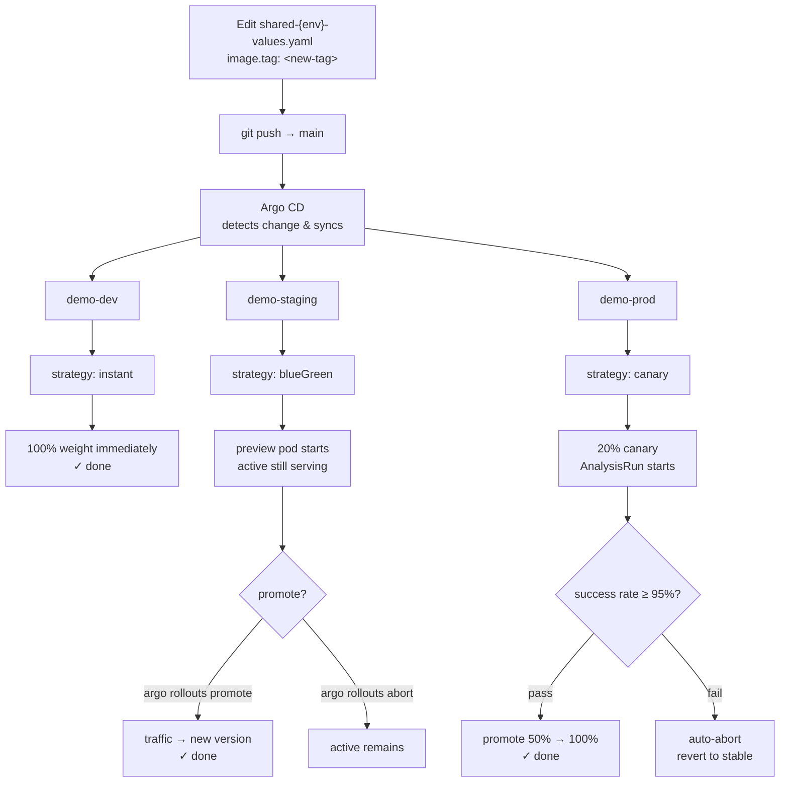

# Operations Guide: Triggering Deployments & Watching Rollouts

Open [`argo-links.html`](./argo-links.html) in your browser for one-click port-forwards and copy-paste commands covering everything below.

## Contents

- [Prerequisites](#prerequisites)
- [How It Works](#how-it-works)
- [Environments](#environments)
- [Files](#files)
- [First-Time Bootstrap](#first-time-bootstrap)
- [Trigger a Deploy](#trigger-a-deploy)
- [Dev — Automatic (CI-Driven)](#dev--automatic-ci-driven)
- [Release Workflow (Semver Tags)](#release-workflow-semver-tags)
- [Staging — BlueGreen (Manual Promotion)](#staging--bluegreen-manual-promotion)
- [Prod — Canary + Analysis (Manual Promotion)](#prod--canary--analysis-manual-promotion)
  - [Prod-East (Multi-Cluster Overlay)](#prod-east-multi-cluster-overlay)
  - [ServiceMonitor and Prometheus Metrics](#servicemonitor-and-prometheus-metrics)
- [Simulate a Failure (Prod Canary)](#simulate-a-failure-prod-canary)
- [Verify: Full State Snapshot](#verify-full-state-snapshot)
- [Common States](#common-states)
- [UI Access](#ui-access)

## Prerequisites

- `kubectl` configured for the target cluster
- `kubectl argo rollouts` plugin ([install guide](https://argoproj.github.io/argo-rollouts/installation/#kubectl-plugin-installation))
- Argo CD UI or `argocd` CLI access
- Prometheus running in `monitoring` namespace (required for prod analysis)

---

## How It Works

```
Edit environments/{env}/shared-{env}-values.yaml → image.tag: <new-tag>
  → git commit + push
  → Argo CD detects change (polls Git every 3 min, or force-refresh)
  → Kustomize renders: base Helm chart + shared values + cluster overrides
  → Application Controller applies diff to cluster
  → Argo Rollouts controller executes the strategy for that environment
```

A single ApplicationSet (`rollouts-demo`) scans `environments/*/*` and generates one Application per directory.



---

## Environments

| App (Argo CD) | Namespace | Rollout name | Strategy | Replicas |
|---|---|---|---|---|
| `demo-dev` | `demo-dev` | `demo-app` | instant | 1 |
| `demo-staging` | `demo-staging` | `demo-app` | blueGreen (manual promote) | 2 |
| `demo-prod` | `demo-prod` | `demo-app` | canary + analysis (manual steps) | 3 |
| `demo-prod-east` | `demo-prod-east` | `demo-app` | canary + analysis (multi-cluster overlay test) | 3 |

---

## Files

### Promotion (edited during deploys)

| File | Purpose | When to touch |
|------|---------|---------------|
| `gitops-manifests/projects/demo-app/environments/dev/shared-dev-values.yaml` | Dev image tag (CI writes this automatically) | Manual dev deploy only |
| `gitops-manifests/projects/demo-app/environments/staging/shared-staging-values.yaml` | Staging image tag | To promote to staging |
| `gitops-manifests/projects/demo-app/environments/prod/shared-prod-values.yaml` | Prod image tag | To promote to prod |

### Cluster config (rarely changed)

| File | Purpose | When to touch |
|------|---------|---------------|
| `gitops-manifests/projects/demo-app/environments/{env}/{cluster}/values-override.yaml` | Static cluster config (replicas, resources, ingress, region) | When cluster config changes |
| `gitops-manifests/projects/demo-app/environments/{env}/{cluster}/kustomization.yaml` | Layers chart + shared values + cluster overrides | When adding a new cluster |

Cluster overrides can set any Helm value — not just replicas. For example, prod clusters set higher CPU/memory limits:

```yaml
# environments/prod/prod/values-override.yaml
replicaCount: 3

resources:
  requests:
    cpu: 250m
    memory: 128Mi
  limits:
    cpu: "1"
    memory: 256Mi

ingress:
  host: demo-app.prod.us-west.example.com

env:
  AWS_REGION: "us-west-2"
```

Dev and staging inherit the base defaults from `go-app/deploy/demo-app/values.yaml` (50m CPU, 32Mi memory).

### Argo CD setup (one-time)

| File | Purpose | When to touch |
|------|---------|---------------|
| `gitops-manifests/projects/demo-app/argo/applicationset.yaml` | Argo CD ApplicationSet (all envs) | First-time setup only |
| `gitops-manifests/projects/demo-app/argo/appproject.yaml` | Argo CD AppProject | First-time setup only |
| `gitops-manifests/clusters/shared/bootstrap-app.yaml` | ClusterAnalysisTemplate bootstrap App | First-time setup only |

### Helm chart (source of truth for templates)

| File | Purpose | When to touch |
|------|---------|---------------|
| `go-app/deploy/demo-app/values.yaml` | Base defaults (all envs inherit from this) | When adding new chart values |
| `go-app/deploy/demo-app/templates/` | K8s resource templates (Rollout, Service, etc.) | When changing resource definitions |

### Scripts

| File | Purpose |
|------|---------|
| `scripts/dev-update-app.sh` | Set dev image tag and push, or trigger CI build (`--dispatch`) |
| `docs/pf.sh` | Start/stop port-forwards for all UIs |

**Values layer order:** `go-app/deploy/demo-app/values.yaml` → `shared-{env}-values.yaml` → `{cluster}/values-override.yaml`

---

## First-Time Bootstrap

```bash
# 1. Bootstrap ClusterAnalysisTemplate (Prometheus success-rate check used in prod)
kubectl apply -f gitops-manifests/clusters/shared/bootstrap-app.yaml

# 2. Create the AppProject + ApplicationSet
kubectl apply -f gitops-manifests/projects/demo-app/argo/appproject.yaml
kubectl apply -f gitops-manifests/projects/demo-app/argo/applicationset.yaml
```

Argo CD creates all namespaces and syncs all apps immediately.

Verify:

```bash
kubectl get applications -n argocd | grep demo
# demo-dev        Synced  Healthy
# demo-staging    Synced  Healthy
# demo-prod       Synced  Healthy
# demo-prod-east  Synced  Healthy
```

---

## Trigger a Deploy

```bash
# 1. Edit the image tag in the target env
#    Dev:     gitops-manifests/projects/demo-app/environments/dev/shared-dev-values.yaml
#    Staging: gitops-manifests/projects/demo-app/environments/staging/shared-staging-values.yaml
#    Prod:    gitops-manifests/projects/demo-app/environments/prod/shared-prod-values.yaml

# 2. Push
git add gitops-manifests/projects/demo-app/environments/<env>/shared-<env>-values.yaml
git commit -m "chore: deploy <tag> to <env>"
git push origin main

# 3. Force sync immediately (instead of waiting ~3 min)
kubectl annotate application demo-<env> -n argocd \
  argocd.argoproj.io/refresh=hard --overwrite
```

---

## Dev — Automatic (CI-Driven)

Every push to `main` in `go-app/` triggers `build-main.yaml`:
1. Builds and pushes a SHA image to ECR
2. Commits the new `image.tag` to `environments/dev/shared-dev-values.yaml`
3. Argo CD auto-syncs `demo-dev`
4. Argo Rollouts executes the instant strategy (100% immediately, no gates)

No manual action needed for dev.

To deploy a specific tag to dev without a code change:

```bash
vim gitops-manifests/projects/demo-app/environments/dev/shared-dev-values.yaml

git add gitops-manifests/projects/demo-app/environments/dev/shared-dev-values.yaml
git commit -m "chore: deploy sha-<new> to dev"
git push origin main
```

Verify:

```bash
kubectl argo rollouts get rollout demo-app -n demo-dev

kubectl get pods -n demo-dev \
  -o jsonpath='{.items[0].spec.containers[0].image}'
```

---

## Release Workflow (Semver Tags)

Pushing a semver tag (e.g. `v1.2.3`) triggers `.github/workflows/build-release.yaml`:

1. Runs `go test ./...`
2. Builds and pushes a tagged image to ECR (`demo-app:v1.2.3`)
3. Packages the Helm chart with the matching version and pushes it to ECR OCI (`demo-app-chart:1.2.3`)

This workflow does **not** auto-promote to any environment. To deploy the release, update `image.tag` in the target environment's shared values file and open a PR.

```bash
# Create a release
git tag v1.2.3
git push origin v1.2.3
```

---

## Staging — BlueGreen (Manual Promotion)

Preview pod (new version) runs alongside the active pod (old version) until you promote.
`autoPromotionEnabled: false` — nothing moves until you say so.

Edit `shared-staging-values.yaml` with the semver tag you want to promote:

```yaml
# gitops-manifests/projects/demo-app/environments/staging/shared-staging-values.yaml
image:
  tag: "1.2.3"   # ← update this
```

```bash
git add gitops-manifests/projects/demo-app/environments/staging/shared-staging-values.yaml
git commit -m "chore: promote demo-app 1.2.3 to staging"
git push origin main
```

Force sync immediately (instead of waiting ~3 min):

```bash
kubectl annotate application demo-staging -n argocd \
  argocd.argoproj.io/refresh=hard --overwrite
```

### Watch the BlueGreen Rollout

```bash
# Watch — pauses when preview pod is ready (active still serving)
kubectl argo rollouts get rollout demo-app -n demo-staging --watch

# Promote: cut traffic from active → preview
kubectl argo rollouts promote demo-app -n demo-staging

# Abort: keep active, delete preview
kubectl argo rollouts abort demo-app -n demo-staging
```

---

## Prod — Canary + Analysis (Manual Promotion)

Edit `shared-prod-values.yaml` with the semver tag:

```yaml
# gitops-manifests/projects/demo-app/environments/prod/shared-prod-values.yaml
image:
  tag: "1.2.3"   # ← update this
```

```bash
git add gitops-manifests/projects/demo-app/environments/prod/shared-prod-values.yaml
git commit -m "chore: promote demo-app 1.2.3 to prod"
git push origin main
```

> **Note:** `loadgen.enabled: true` is set in `shared-prod-values.yaml`. Wait ~2 minutes after first deploy for Prometheus to have data, or the AnalysisRun will get inconclusive results.

### Watch the Canary Rollout

Canary steps: `setWeight 20 → pause {} → setWeight 50 → pause {} → setWeight 100`

AnalysisRun starts at step 1 (after 20% weight) and runs Prometheus checks every 30s. Auto-aborts if success rate < 95%.

```bash
# Watch rollout progression and current step
kubectl argo rollouts get rollout demo-app -n demo-prod --watch

# Watch AnalysisRun (one created per rollout)
kubectl get analysisruns -n demo-prod -w

# Inspect analysis measurements
kubectl get analysisrun <name> -n demo-prod \
  -o jsonpath='{.status.metricResults}' | python3 -m json.tool

# Advance past a manual pause (once satisfied with canary health)
kubectl argo rollouts promote demo-app -n demo-prod

# Abort and revert to stable
kubectl argo rollouts abort demo-app -n demo-prod

# Retry after abort
kubectl argo rollouts retry rollout demo-app -n demo-prod
```

### Force Sync

```bash
kubectl annotate application demo-prod -n argocd \
  argocd.argoproj.io/refresh=hard --overwrite
```

### Prod-East (Multi-Cluster Overlay)

`demo-prod-east` shares `shared-prod-values.yaml` with `demo-prod` — changing the image tag promotes to both clusters simultaneously. The only differences are in `environments/prod/prod-east/values-override.yaml` (ingress host, AWS region).

To watch or promote prod-east independently:

```bash
kubectl argo rollouts get rollout demo-app -n demo-prod-east --watch
kubectl argo rollouts promote demo-app -n demo-prod-east
```

### ServiceMonitor and Prometheus Metrics

The Helm chart deploys a ServiceMonitor (enabled by default via `metrics.enabled: true`) that scrapes `/metrics` on port `http` every 15s. This is what feeds the AnalysisRun's Prometheus success-rate query during canary rollouts.

If kube-prometheus-stack is not installed, the ServiceMonitor resource is harmless — Kubernetes ignores CRDs it doesn't recognize. But without Prometheus, AnalysisRuns in prod will return inconclusive results and eventually fail.

---

## Simulate a Failure (Prod Canary)

To test automatic rollback, cause the canary pod to return errors during the analysis window:

```bash
# Find a canary pod
kubectl get pods -n demo-prod -l rollouts-pod-template-hash=<canary-hash>

# Exec in and hit a 5xx endpoint
kubectl exec -n demo-prod <pod> -- wget -qO- http://localhost:8080/fail

# Watch the AnalysisRun detect the degraded success rate and abort
kubectl get analysisruns -n demo-prod -w
```

The AnalysisRun will record a failure measurement. After `failureLimit: 1` failures, it marks itself `Failed`, and Argo Rollouts immediately aborts the canary and reverts to stable.

---

## Verify: Full State Snapshot

```bash
# All Argo CD apps in this demo
kubectl get applications -n argocd | grep demo

# Rollout status per environment
kubectl argo rollouts get rollout demo-app -n demo-dev
kubectl argo rollouts get rollout demo-app -n demo-staging
kubectl argo rollouts get rollout demo-app -n demo-prod
kubectl argo rollouts get rollout demo-app -n demo-prod-east

# AnalysisRuns for prod (one per rollout)
kubectl get analysisruns -n demo-prod
kubectl get analysisruns -n demo-prod-east

# What image is running in each environment
for ns in demo-dev demo-staging demo-prod demo-prod-east; do
  echo "$ns: $(kubectl get pods -n $ns -o jsonpath='{.items[0].spec.containers[0].image}' 2>/dev/null)"
done
```

---

## Common States

| sync.status | health.status | Meaning |
|---|---|---|
| Synced | Healthy | All good |
| OutOfSync | Healthy | Git change not yet applied |
| Synced | Progressing | Rollout in progress |
| OutOfSync | Degraded | Something broken — check `kubectl describe` |

---

## UI Access

| UI | Port-forward | Address |
|----|-------------|---------|
| Argo CD | `kubectl port-forward svc/argocd-server -n argocd 8080:80` | http://localhost:8080 |
| Rollouts Dashboard | `kubectl port-forward svc/argo-rollouts-dashboard -n argo-rollouts 3100:3100` | http://localhost:3100/rollouts |
| Prometheus (prod analysis) | `kubectl port-forward svc/kube-prometheus-stack-prometheus -n monitoring 9090:9090` | http://localhost:9090 |

Or start all at once: `bash docs/pf.sh start` (stop with `bash docs/pf.sh stop`)
